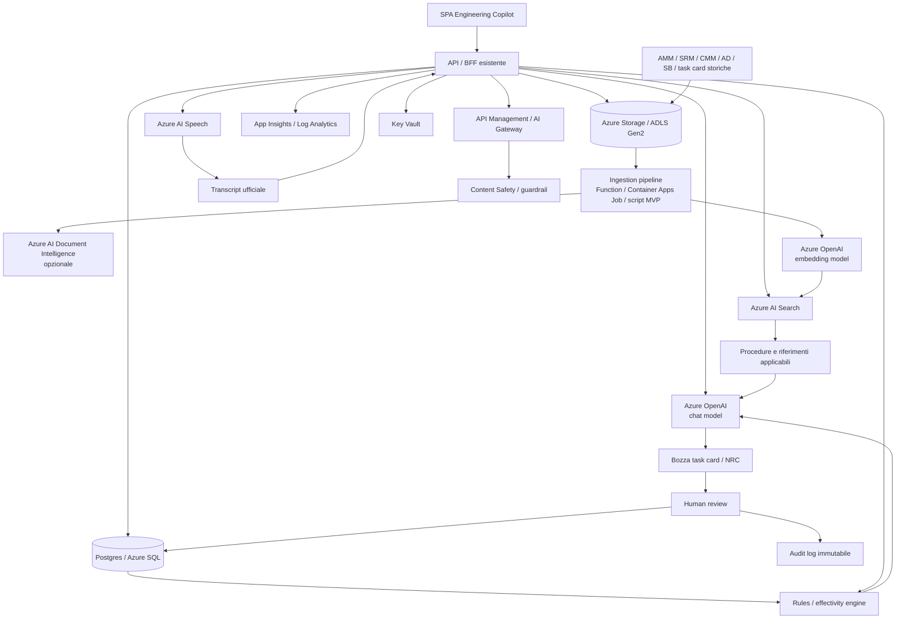

# AI03 - Architettura automazione documentazione EASA

Questo documento sintetizza le componenti architetturali necessarie per implementare l'Engineering Copilot dedicato alla documentazione EASA, usando il modello ibrido:

```text
Azure AI Speech
-> transcript ufficiale
-> Azure OpenAI
-> estrazione strutturata + generazione controllata
-> Azure AI Search
-> retrieval documentale
-> rules/effectivity engine
-> bozza task card
-> human review
-> audit log + knowledge capture
```

La separazione tra speech-to-text e LLM è intenzionale. In un contesto EASA/AI Act conviene poter auditare separatamente cosa ha detto il tecnico, cosa è stato trascritto, cosa ha inferito il modello, quali fonti sono state recuperate e cosa ha approvato o corretto l'ingegnere.

# Scope funzionale

La capability copre:

- input vocale strutturato durante attività manutentive;
- trascrizione persistita e revisionabile;
- estrazione di finding, asset, work order, misure e contesto tecnico;
- recupero RAG di procedure AMM/SRM/CMM/AD/SB e task card storiche;
- verifica deterministica di effectivity, revisione, MSN, SB embodied e stop condition;
- generazione di bozze task card routine e Non-Routine Card;
- revisione umana, approvazione, correzione o rigetto;
- audit trail e preservazione della conoscenza ingegneristica.

# Componenti architetturali

| Componente | Ruolo | Note architetturali |
|---|---|---|
| SPA esistente | Interfaccia per tecnico e ingegnere | Nuove viste per voice input, transcript, preview task card, review e approvazione/rigetto |
| API esistente | Orchestrazione applicativa | Nuovi endpoint engineering per speech, extraction, RAG, effectivity, generation e review |
| Azure AI Speech | Speech-to-text | Produce il transcript ufficiale, persistito e auditabile |
| Azure OpenAI - chat model | Estrazione e generazione | Estrae JSON strutturato dal transcript e genera bozze task card/NRC vincolate alle fonti |
| Azure OpenAI - embedding model | Embedding documentali | Genera vettori per indicizzazione e ricerca semantica |
| Azure AI Search | Motore RAG | Hybrid search, vector search e filtri metadata su manuali e task card |
| Azure Storage / ADLS Gen2 | Storage contenuti | Documenti sorgente, audio, transcript, evidenze, allegati, log grezzi |
| Database operativo | Stato applicativo | Work order, draft task card, review status, metadata effectivity, decision rationale |
| Ingestion pipeline | Indicizzazione documenti | Normalizza, chunka, arricchisce e indicizza contenuti tecnici |
| Azure AI Document Intelligence | Estrazione layout/documenti | Opzionale per PDF, tabelle complesse o documenti scansionati |
| Rules/effectivity engine | Controlli deterministici | Verifica applicabilità della procedura senza delegare la decisione al LLM |
| Human review workflow | Validazione umana | L'AI propone, l'ingegnere/certifying staff valida, corregge o rigetta |
| Audit log | Tracciabilità | Prompt, output, fonti, revisioni, decisioni umane, timestamp e utente |
| API Management / AI Gateway | Governance API e AI | Auth, rate limit, cost control, logging centralizzato, policy AI |
| Key Vault | Segreti e chiavi | API key, connection string, secret, eventuali CMK |
| Application Insights / Log Analytics | Osservabilità | Latenze, errori, tracing, metriche RAG/LLM, audit tecnico |
| Content Safety / guardrail | Sicurezza AI | Prompt injection, output non conforme, data leakage, abuso del modello |
| Entra ID / RBAC | Identità e autorizzazioni | Ruoli separati: tecnico, ingegnere, quality, admin |

# Architettura logica



# Flusso runtime

1. Il tecnico apre la SPA e registra o detta un finding.
2. La SPA invia l'audio all'API.
3. L'API invoca Azure AI Speech.
4. Azure AI Speech produce il transcript ufficiale.
5. L'API salva transcript, metadati, audio URI e riferimento al work order.
6. L'API invoca Azure OpenAI per estrarre un payload strutturato dal transcript.
7. Il payload contiene work order, aircraft, MSN, finding, misure, posizione e azione richiesta.
8. L'API usa Azure AI Search per recuperare procedure AMM/SRM/CMM/AD/SB e task card storiche rilevanti.
9. Il rules/effectivity engine verifica applicabilità, mod status, revisioni, limiti e stop condition.
10. Azure OpenAI genera una bozza di task card o Non-Routine Card usando solo fonti citate.
11. L'ingegnere revisiona la bozza nella SPA.
12. L'ingegnere approva, corregge o rigetta.
13. Il sistema salva decisione, fonti, prompt/output, revisioni e audit trail.
14. Le correzioni validate alimentano knowledge object riusabili.

# Endpoint API proposti

| Endpoint | Metodo | Scopo |
|---|---|---|
| `/engineering/transcribe` | `POST` | Riceve audio e restituisce transcript persistito |
| `/engineering/extract-finding` | `POST` | Converte transcript in JSON strutturato |
| `/engineering/search-procedures` | `POST` | Recupera procedure applicabili da Azure AI Search |
| `/engineering/check-effectivity` | `POST` | Verifica MSN, SB embodied, revisioni, limiti e stop condition |
| `/engineering/generate-task-card` | `POST` | Genera bozza task card/NRC |
| `/engineering/task-cards/{id}` | `GET` | Recupera bozza o card validata |
| `/engineering/task-cards/{id}/review` | `POST` | Approva, corregge o rigetta la bozza |
| `/engineering/audit/{id}` | `GET` | Recupera audit trail della generazione e review |

# Dati principali

## Transcript

```json
{
  "id": "tr-2026-0001",
  "work_order": "WO-2026-04571",
  "audio_uri": "blob://engineering-audio/2026/tr-2026-0001.wav",
  "transcript_text": "WO 2026-04571, engine MSN 0123...",
  "language": "it-IT",
  "created_by": "technician-123",
  "created_at": "2026-07-13T10:00:00Z"
}
```

## Finding strutturato

```json
{
  "work_order": "WO-2026-04571",
  "aircraft_registration": "F-PoC1",
  "engine_msn": "0123",
  "source_task_card": "TC-0001",
  "finding": {
    "area": "HPC",
    "stage": 4,
    "blade": 17,
    "type": "leading-edge nick",
    "measurement_mm": 1.0
  },
  "requested_output": "non_routine_card"
}
```

## Risultato effectivity

```json
{
  "task_id": "72-30-00-300-002",
  "applicable": false,
  "required_condition": "POST-MOD 7204",
  "actual_condition": "UNKNOWN",
  "action": "VERIFY_BEFORE_USE",
  "message": "SB 7204 embodied status must be verified before using this repair task."
}
```

## Bozza task card

```json
{
  "id": "draft-nrc-0001",
  "type": "non_routine_card",
  "status": "pending_review",
  "work_order": "WO-2026-04571",
  "references": [
    {
      "source": "AMM",
      "task": "72-30-00-300-002",
      "revision": "Rev. 13",
      "applicability": "POST-MOD 7204"
    }
  ],
  "sections": {
    "finding": "...",
    "effectivity_gate": "...",
    "procedure": [],
    "tooling": [],
    "safety": [],
    "acceptance_limits": [],
    "disposition": []
  }
}
```

# Storage e persistenza

| Tipo dato | Dove salvarlo | Note |
|---|---|---|
| Audio originale | Azure Storage / ADLS Gen2 | Utile per audit e rianalisi |
| Transcript | Database + storage | Testo ricercabile e riferimento al file audio |
| Manuali AMM/SRM/CMM/AD/SB | Azure Storage / ADLS Gen2 | Fonte documentale governata |
| Chunk indicizzati | Azure AI Search | Con metadati: ATA, revisione, effectivity, fonte |
| Task card draft | Database operativo | Stato revisionabile |
| Task card approvate | Database + storage | Versionate |
| Prompt/output LLM | Audit log | Con retention e accesso limitato |
| Decision rationale | Database / knowledge store | Riutilizzabile per preservare expertise |
| Evidenze tecniche | Azure Storage / ADLS Gen2 | Immagini, video, borescope frame |

# Indice Azure AI Search

Campi consigliati:

| Campo | Tipo | Uso |
|---|---|---|
| `id` | string | Identificativo chunk |
| `document_type` | string | AMM, SRM, CMM, AD, SB, task_card |
| `source_name` | string | Nome documento |
| `source_uri` | string | Link al documento sorgente |
| `ata_chapter` | string | Filtro tecnico |
| `task_id` | string | Es. 72-30-00-300-002 |
| `revision` | string | Revisione documento |
| `revision_date` | date | Validità temporale |
| `effectivity` | string | ALL, PRE-MOD, POST-MOD, MSN range |
| `content` | string | Testo chunk |
| `content_vector` | vector | Embedding |
| `safety_level` | string | Warning, caution, normal |
| `approved_source` | boolean | Esclude fonti non approvate dalla generazione |

# Rules/effectivity engine

Questo componente non deve essere lasciato al solo LLM. Deve applicare regole deterministiche prima che la bozza venga proposta all'ingegnere.

Esempio:

```json
{
  "task_id": "72-30-00-300-002",
  "requires": {
    "mod_status": "POST-MOD 7204"
  },
  "if_not_satisfied": {
    "action": "STOP",
    "message": "Task does not apply. Request OEM/DOA disposition."
  }
}
```

Regole minime:

| Regola | Perché serve |
|---|---|
| Verifica MSN | La procedura può essere applicabile solo a certi velivoli/componenti |
| Verifica SB embodied | Alcune procedure valgono solo PRE-MOD o POST-MOD |
| Verifica revisione | Evita uso di manuali superati |
| Verifica limiti numerici | Es. nick > 0.8 mm, blend depth <= 1.2 mm |
| Verifica stop condition | Blocca generazione operativa quando serve escalation |
| Verifica fonte approvata | Esclude fonti non ufficiali o non validate |

# Governance e sicurezza

| Controllo | Implementazione |
|---|---|
| Identità | Entra ID, ruoli tecnico/ingegnere/quality/admin |
| Segreti | Key Vault |
| Isolamento rete | Private endpoints per Search, Storage, DB, Azure OpenAI e Speech |
| Audit | Log immutabile su storage con retention |
| AI Gateway | API Management davanti alle chiamate AI |
| Guardrail | Content Safety + prompt injection checks |
| Human-in-the-loop | Nessun CRS o approvazione finale generata automaticamente |
| Data residency | Risorse in regioni EU |
| Logging | Application Insights + Log Analytics |
| Versioning fonti | Document version e revision obbligatorie nel retrieval |
| Accesso ai documenti | RBAC e managed identity |

# MVP pratico

Per una prima implementazione credibile non serve costruire subito tutto in forma enterprise. L'MVP può essere leggero, ma deve mantenere chiari i confini regolatori: AI propone, umano valida, audit traccia.

## Scelte MVP

| Componente | Scelta MVP |
|---|---|
| UI | Integrare una pagina nella SPA esistente |
| API | Aggiungere router/endpoint engineering alla API esistente |
| Speech | Azure AI Speech |
| LLM | Azure OpenAI chat model |
| Embedding | Azure OpenAI embedding model |
| RAG | Azure AI Search |
| Storage | Azure Blob Storage |
| DB | Postgres esistente |
| Ingestion | Script o job semplice per indicizzare markdown/PDF |
| Rules engine | Funzioni hardcoded iniziali |
| Audit | Tabella DB + append blob |
| Review | Stati `draft`, `pending_review`, `approved`, `rejected` nella UI |

## Sequenza MVP

1. Caricare i documenti sample in Blob Storage.
2. Indicizzare AMM sample e task card sample in Azure AI Search.
3. Creare endpoint API per cercare procedure rilevanti.
4. Creare endpoint API per generare una bozza NRC da input testuale.
5. Aggiungere Azure AI Speech e transcript persistito.
6. Aggiungere extraction JSON dal transcript.
7. Aggiungere rules/effectivity engine per 2-3 casi dimostrativi.
8. Aggiungere pagina SPA per review della bozza.
9. Salvare approvazione, correzione o rigetto.
10. Salvare audit trail della generazione.

## Scenario demo consigliato

```text
Routine card: HPC Borescope Inspection
Finding: stage 4 blade 17, leading-edge nick 1.0 mm
Regola: > 0.8 mm richiede NRC
Procedura suggerita: HPC Blade Blending Repair
Gate: POST-MOD 7204 required
Output: Non-Routine Card con warning, limiti e citazioni
Review: ingegnere verifica SB 7204 e approva/corregge
```

Questo scenario è piccolo ma dimostra tutte le capability chiave:

- voice-to-text;
- structured extraction;
- RAG;
- citazioni;
- effectivity gate;
- generazione NRC;
- human review;
- audit;
- knowledge capture.

# Decisioni aperte

| Tema | Opzioni | Raccomandazione iniziale |
|---|---|---|
| Database operativo | Postgres esistente vs Azure SQL | Riusare Postgres per MVP |
| Ingestion | Script manuale vs Function/Container App Job | Script per MVP, job per produzione |
| Document Intelligence | Subito vs fase 2 | Fase 2 se i documenti sono markdown/testo; subito se PDF complessi |
| Audit immutabile | Tabella DB vs Blob immutable | DB + append blob per MVP, Blob immutable in produzione |
| Speech | Azure AI Speech vs multimodale audio | Azure AI Speech + Azure OpenAI, modello ibrido |
| Rules engine | Hardcoded vs motore regole dedicato | Hardcoded iniziale, poi configurabile |
| Workflow review | API custom vs Durable Functions | API custom per MVP, Durable Functions se il workflow cresce |

# Principio architetturale

Il componente critico non è il modello LLM da solo, ma il contratto tra RAG, regole deterministiche, revisione umana e audit.

```text
voce tecnico
-> transcript ufficiale
-> finding strutturato
-> retrieval con fonti citate
-> verifica effectivity deterministica
-> bozza task card
-> validazione umana
-> audit trail
-> knowledge capture
```

La Gen AI accelera la documentazione, ma la responsabilità tecnica e certificativa resta sempre umana.