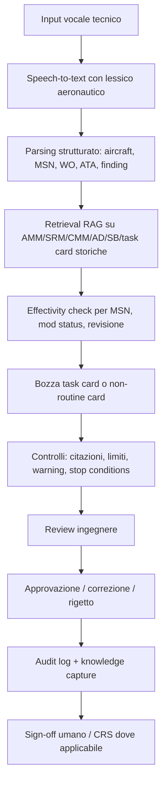

# Automazione documentazione EASA e preservazione dell'expertise ingegneristica

Un assistente ingegneristico Gen AI recupera le procedure di manutenzione e compila le task card EASA a partire da input vocali strutturati durante le operazioni di manutenzione.

La piattaforma introduce un Engineering Copilot per la documentazione EASA che combina speech-to-text, retrieval aumentato su manuali AMM/SRM/CMM/AD/SB e generazione controllata di task card. Il sistema non sostituisce l’ingegnere certificatore: precompila routine e non-routine card con riferimenti, revisioni, limiti ed effectivity gate, mentre la validazione e il CRS restano responsabilità del personale autorizzato. Le correzioni e decisioni degli ingegneri vengono tracciate e trasformate in knowledge object governati, preservando l’expertise senior e riducendo l’effort documentale.

> Non vendere Gen AI come autore della manutenzione, ma come acceleratore regolato dell'ingegneria documentale.

# Idea centrale

L’assistente serve soprattutto in due casi:

## Task card routine
La procedura è già nota: l’AI aiuta a istanziare la card corretta per aircraft/MSN/work order, allega revisione AMM/MPD corretta, precompila campi, strumenti, safety notes, limiti e checklist.

## Task card non-routine
È il caso più prezioso. Durante un’ispezione emerge un finding: nick, crack, corrosione, vibrazione, EGT anomaly, chip detection. Il tecnico detta un input strutturato, l’assistente recupera AMM/SRM/CMM/AD/SB applicabili, verifica effectivity e propone una bozza di Non-Routine Card con citazioni, limiti e stop condition.

Esempio:

```text
Tecnico:
"WO 2026-04571, engine MSN 0123, durante HPC borescope stage 4 blade 17,
leading edge nick stimato 1.0 millimetri, SB 7204 da verificare."

Assistente:
- identifica ATA 72 / HPC
- recupera AMM Task 72-00-00-200-001
- vede che nick > 0.8 mm richiede percorso repair/non-routine
- recupera Task 72-30-00-300-002
- segnala gate: POST-MOD 7204 required
- genera bozza NRC
- chiede verifica effectivity prima dell’esecuzione
```

Questa decisione non deve essere interpretata creativamente dal modello. La Gen AI scrive la bozza, ma il sistema deve avere un piccolo rules/effectivity engine che impedisce di proporre procedure non applicabili.

Esempio di gate deterministico:

```json
{
	"task_id": "72-30-00-300-002",
	"requires": {
		"mod_status": "POST-MOD 7204"
	},
	"if_not_satisfied": {
		"action": "STOP",
		"message": "Task does not apply. Request OEM/DOA disposition."
	}
}
```

# Flusso end-to-end



# Componenti implementativi

| Blocco | Cosa fa | Servizio / pattern possibile |
|---|---|---|
| Voice capture | Registra o detta il finding in hangar | PWA tecnico + Azure AI Speech |
| Structured extraction | Trasforma la voce in JSON operativo | LLM con schema vincolato |
| Knowledge ingestion | Indicizza AMM, SRM, CMM, AD, SB e task card storiche | Azure AI Search hybrid/vector |
| RAG engineering | Recupera procedure, fonti e revisioni applicabili | Azure OpenAI + Azure AI Search |
| Effectivity engine | Verifica MSN, SB embodied, aircraft configuration e revisione | Regole deterministiche + database operativo |
| Task card generator | Produce la bozza EASA-style | Template + LLM tool calling |
| Human review | Permette a ingegnere/certifying staff di validare, correggere o rigettare | UI con citazioni, diff e warning |
| Audit & compliance | Traccia prompt, fonti, revisioni, decisioni e approvazioni | Log immutabile + Purview/Monitor |

# Input vocale strutturato

Per evitare input troppo libero, il tecnico dovrebbe usare una grammatica semplice:

```text
Work order: ...
Aircraft registration: ...
Engine MSN: ...
Inspection source: ...
Finding location: ...
Finding type: ...
Measured value: ...
Evidence: photo/video/borescope frame attached
Requested action: create non-routine card
```

Il sistema converte la trascrizione in un payload strutturato:

```json
{
	"work_order": "WO-2026-04571",
	"aircraft_registration": "F-PoC1",
	"engine_msn": "0123",
	"source_task_card": "TC-0001",
	"finding": {
		"area": "HPC",
		"stage": 4,
		"blade": 17,
		"type": "leading-edge nick",
		"measurement_mm": 1.0
	},
	"requested_output": "non_routine_card"
}
```

# Output atteso: bozza di task card

La bozza generata deve essere strutturata, verificabile e pronta per la revisione umana. Se nasce da un finding, l'output è una Non-Routine Card.

| Sezione | Contenuto |
|---|---|
| Identificazione | WO, aircraft, engine MSN, registration, ATA |
| Finding | Descrizione, posizione, misure, evidenze |
| Fonte | Task routine o ispezione da cui nasce il finding |
| Riferimenti | AMM/SRM/CMM/AD/SB con revisione |
| Effectivity gate | Applicabile, non applicabile o da verificare |
| Procedura proposta | Step operativi |
| Tooling | Strumenti necessari |
| Safety | Warning e caution obbligatori |
| Acceptance limits | Limiti numerici e condizioni di stop |
| Disposition | Repaired / engineering / OEM-DOA |
| Sign-off | Mechanic, inspector, CRS umano dove applicabile |

# Preservare l'expertise ingegneristica

Il valore non è solo automatizzare la compilazione. Ogni correzione dell'ingegnere può diventare conoscenza riusabile e governata:

- quale fonte era davvero rilevante;
- quale procedura è stata scelta;
- perché una procedura è stata esclusa;
- quali finding ricorrenti richiedono escalation OEM/DOA;
- quali formulazioni sono accettate dal quality department;
- quali errori l'assistente tendeva a fare.

Esempio di knowledge object:

```json
{
	"finding_pattern": "HPC leading-edge nick > 0.8mm and <= 1.2mm",
	"applicable_when": "POST-MOD 7204",
	"recommended_path": "NRC referencing AMM 72-30-00-300-002",
	"mandatory_gate": "verify SB 7204 embodied",
	"escalate_when": "depth > 1.2mm or PRE-MOD 7204",
	"validated_by_role": "Part-145 certifying engineer"
}
```

In questo modo la piattaforma codifica la conoscenza tacita degli ingegneri senior: non solo dove cercare, ma anche come decidere, quando fermarsi e quando coinvolgere OEM/DOA.

# Governance EASA / EU AI Act

In ambito EASA e AI Act la distinzione di responsabilità deve essere esplicita:

- AI può proporre;
- AI può recuperare procedure e revisioni;
- AI può precompilare task card;
- AI può evidenziare incoerenze, mancanza di effectivity o stop condition;
- AI non può approvare;
- AI non può firmare CRS;
- AI non può sostituire approved maintenance data.

Controlli minimi da prevedere:

| Controllo | Motivazione |
|---|---|
| Citazioni obbligatorie | Ogni step deve rimandare alla fonte AMM/SRM/CMM/AD/SB e alla revisione |
| Human-in-the-loop | La decisione finale resta a ingegnere/certifying staff autorizzato |
| Audit trail immutabile | Necessario per ispezioni, accountability e AI Act |
| Versioning dei documenti | Evita uso di procedure superate |
| Effectivity check | Evita procedure non applicabili a MSN/mod status |
| Rejection workflow | L'ingegnere deve poter rigettare o correggere l'output AI |
| Prompt/output logging | Traccia il comportamento del sistema e abilita miglioramento continuo |

# Roadmap MVP

## MVP 1: RAG su documenti sintetici
Indicizzare AMM sample e task card sample. Input testuale strutturato. Output: bozza task card con citazioni.

## MVP 2: Voice-to-card
Aggiungere speech-to-text e parsing JSON. Il tecnico detta il finding e il sistema propone una NRC.

## MVP 3: Effectivity gate
Aggiungere regole su MSN, SB embodied, revisioni e stop condition. Questa è la parte che rende la demo più credibile in ambito aviation.

## MVP 4: Human review + audit
UI per ingegnere: accetta, modifica, rigetta. Salvataggio di audit trail, fonti, revisioni e motivazione.

## MVP 5: Knowledge preservation
Le correzioni validate alimentano una knowledge base di decision rationale e casi precedenti.

# Impatti sui numeri del caso studio

| Metrica | Prima | Dopo | Ruolo dell'AI |
|---|---:|---:|---|
| Effort documentazione EASA | 4.500 h/uomo/anno | -55% | Drafting automatico + retrieval della procedura/revisione corretta |
| First-time-fix | 71% | 89% | Procedura corretta recuperata subito, meno errori e meno escalation tardive |
| Rischio perdita conoscenza | 31% senior in uscita | Mitigato | Decision rationale e conoscenza di ricerca codificati nel knowledge layer governato |

# Acronimi

| Acronimo | Sigla estesa | Significato |
|---|---|---|
| AMM | Aircraft Maintenance Manual | Manuale OEM con procedure ufficiali di manutenzione |
| SRM | Structural Repair Manual | Manuale per riparazioni strutturali approvate |
| CMM | Component Maintenance Manual | Manuale di manutenzione di componenti specifici |
| AD | Airworthiness Directive | Direttiva obbligatoria emessa dall'autorità aeronautica |
| SB | Service Bulletin | Bollettino tecnico emesso dall'OEM |
| MPD | Maintenance Planning Document | Documento OEM per pianificazione manutentiva schedulata |
| WO | Work Order | Ordine di lavoro manutentivo |
| ATA | Air Transport Association chapter | Classificazione standard dei sistemi aeronautici |
| MSN | Manufacturer Serial Number | Numero di serie del velivolo o componente |
| HPC | High Pressure Compressor | Compressore alta pressione del motore |
| EGT | Exhaust Gas Temperature | Temperatura gas di scarico, indicatore utile per trend motore |
| NRC | Non-Routine Card | Scheda aperta per finding non previsto durante manutenzione |
| CRS | Certificate of Release to Service | Certificazione umana di riammissione in servizio |
| DOA | Design Organisation Approval | Organizzazione approvata per disposizioni di progetto/riparazione |