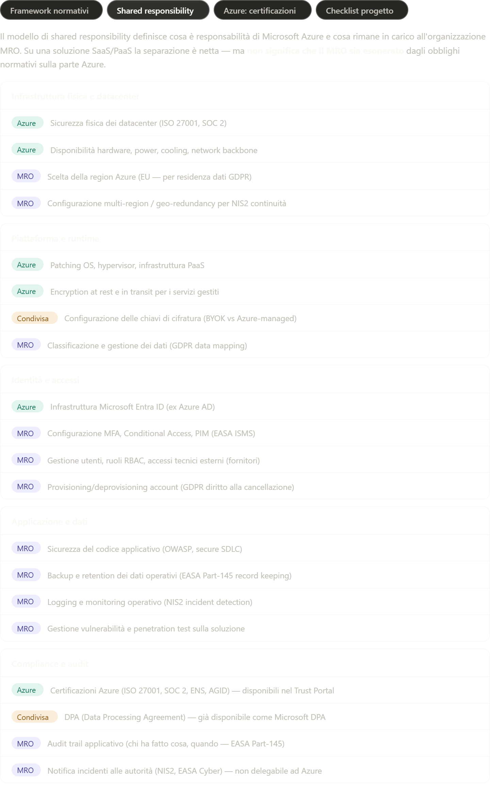

Il modello di shared responsibility definisce cosa è responsabilità di Microsoft Azure e cosa rimane in carico all'organizzazione MRO. Su una soluzione SaaS/PaaS la separazione è netta — ma non significa che il MRO sia esonerato dagli obblighi normativi sulla parte Azure.

Infrastruttura fisica e datacenter

- Azure: Sicurezza fisica dei datacenter (ISO 27001, SOC 2)
- Azure: Disponibilità hardware, power, cooling, network backbone
- MRO: Scelta della region Azure (EU — per residenza dati GDPR)
- MRO: Configurazione multi-region / geo-redundancy per NIS2 continuità

Piattaforma e runtime
- Azure: Patching OS, hypervisor, infrastruttura PaaS
- Azure: Encryption at rest e in transit per i servizi gestiti
- Condivisa: Configurazione delle chiavi di cifratura (BYOK vs Azure-managed)
- MRO: Classificazione e gestione dei dati (GDPR data mapping)

Identità e accessi
- Azure: Infrastruttura Microsoft Entra ID (ex Azure AD)
- MRO: Configurazione MFA, Conditional Access, PIM (EASA ISMS)
- MRO: Gestione utenti, ruoli RBAC, accessi tecnici esterni (fornitori)
- MRO: Provisioning/deprovisioning account (GDPR diritto alla cancellazione)

Applicazione e dati
- MRO: Sicurezza del codice applicativo (OWASP, secure SDLC)
- MRO: Backup e retention dei dati operativi (EASA Part-145 record keeping)
- MRO: Logging e monitoring operativo (NIS2 incident detection)
- MRO: Gestione vulnerabilità e penetration test sulla soluzione

Compliance e audit
- Azure: Certificazioni Azure (ISO 27001, SOC 2, ENS, AGID) — disponibili nel Trust Portal
- Condivisa: DPA (Data Processing Agreement) — già disponibile come Microsoft DPA
- MRO: Audit trail applicativo (chi ha fatto cosa, quando — EASA Part-145)
- MRO: Notifica incidenti alle autorità (NIS2, EASA Cyber) — non delegabile ad Azure
