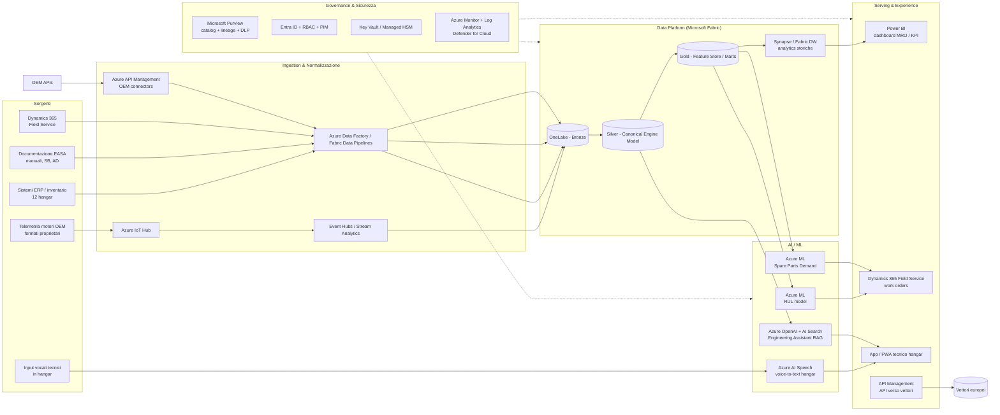

# Architettura Applicativa — Piattaforma MRO Intelligence (v0.1)

> Bozza di alto livello, da raffinare in iterazioni successive.
> Riferimento requisiti: [assignment-ita.md](assignment-ita.md)

## 1. Principi guida

- **Coerenza con SLA operativi**: target AOG < 3h ⇒ pipeline near-real-time per telemetria critica, batch per analisi storiche.
- **Sovranità del dato e compliance**: GDPR + EU AI Act ⇒ residenza dati in EU (region primaria `francecentral`, secondaria `westeurope`), governance centralizzata con Purview.
- **Multi-tenant per vettore**: 6 compagnie clienti ⇒ isolamento logico (RLS / workspace dedicati) su un'unica piattaforma condivisa.
- **AI come capability, non come silo**: i tre modelli (RUL, demand forecasting, Gen AI assistant) condividono feature store, catalogo dati e MLOps.
- **Disaccoppiamento ingestion / analytics / serving**: per gestire 340 aeromobili e formati OEM eterogenei senza colli di bottiglia.

## 2. Vista logica a livelli

## 3. Componenti principali e responsabilità

### 3.1 Ingestion

| Componente | Ruolo | Note |
|---|---|---|
| **Azure IoT Hub** | Ingestion telemetria motori (se disponibile streaming diretto o tramite gateway OEM). | Device provisioning service per i gateway hangar. |
| **Azure Event Hubs + Stream Analytics** | Buffering ad alta cardinalità + pre-processing/anomaly detection real-time. | Alimenta hot path verso RUL e alert AOG. |
| **Azure API Management** | Facciata verso API OEM proprietarie e verso i vettori (output). | Policy per rate limiting, trasformazioni, audit. |
| **Azure Data Factory / Fabric Pipelines** | Batch da ERP, inventario hangar, documentazione EASA, Dynamics 365. | Connettori standard + custom per formati OEM. |

### 3.2 Data platform — Microsoft Fabric / OneLake

- **Bronze**: dati raw, immutabili, partizionati per OEM/flotta/data — base per audit EU AI Act.
- **Silver**: modello canonico unificato "engine health" (lo strato analitico unificato richiesto dal requisito), riconciliazione formati OEM.
- **Gold**: feature store per ML, mart per Power BI, viste per RAG.
- **Synapse / Fabric DW**: query analitiche storiche e reportistica regolatoria.

> Decisione da raffinare: Fabric come piattaforma unica vs. coesistenza con Synapse esistente. Default proposto: **Fabric-first**, Synapse come fallback per workload già consolidati.

### 3.3 AI / ML

| Modello | Tecnologia | Pattern |
|---|---|---|
| **RUL — Remaining Useful Life** | Azure ML, modelli di regressione/survival su feature da Silver/Gold. | Training batch, inferenza near-real-time tramite endpoint managed. |
| **Spare Parts Demand Forecasting** | Azure ML, time-series + ottimizzazione multi-hangar. | Output in Gold → Dynamics 365 per riordino. |
| **Engineering Gen AI Assistant** | Azure OpenAI + Azure AI Search (vector + semantic) su corpus EASA, SB, AD, manuali OEM. | Pattern RAG; tool calling per compilare task card EASA. |
| **Voice-to-task** | Azure AI Speech (custom acoustic/lexical) → assistant. | Funziona offline-tolerant in hangar tramite app PWA. |

MLOps: Azure ML registry + Fabric per dataset versioning + GitHub Actions / Azure DevOps per CI/CD modelli, con gate di valutazione e bias check (requisito EU AI Act).

### 3.4 Serving & UX

- **Power BI**: dashboard AOG, first-time-fix, inventario, KPI per vettore (RLS per tenant).
- **Dynamics 365 Field Service**: orchestrazione work order, integrazione predizioni RUL e disponibilità ricambi.
- **App tecnico hangar** (PWA o app mobile): accesso a Gen AI assistant, input vocali, compilazione task card, funzionamento parzialmente offline.
- **APIM esterno**: espone API curate ai vettori (stato flotta, predizioni, documentazione).

### 3.5 Governance, sicurezza, compliance

- **Microsoft Purview**: catalog, lineage end-to-end (richiesto da EU AI Act per modelli high-risk), classificazione dati personali (GDPR), DLP.
- **Entra ID + RBAC + PIM**: identità federate con vettori, accesso just-in-time per ruoli sensibili.
- **Key Vault / Managed HSM**: gestione segreti e chiavi CMK per storage e Fabric.
- **Private Endpoints + VNet hub-and-spoke**: tutta la piattaforma in rete privata, ingress controllato via APIM + Front Door (se serve esposizione pubblica).
- **Azure Monitor + Log Analytics + Defender for Cloud**: osservabilità unica, alert su SLA AOG, security posture.
- **EU AI Act**: registro modelli, model cards, human-in-the-loop sulle decisioni di manutenzione, audit trail su input/output del Gen AI assistant.

## 4. Mapping requisiti → componenti

| Requisito di business | Componenti chiave | KPI atteso |
|---|---|---|
| AOG 11h → < 3h | IoT Hub + Stream Analytics + Azure ML (RUL) + Dynamics 365 | Tempo AOG medio |
| Visibilità ricambi 12 hangar (+34%) | Fabric (inventario unificato) + Azure ML demand forecast + Dynamics 365 | Stock-out rate, part availability at PoU |
| Documentazione EASA −55% | Azure OpenAI + AI Search + Speech (task card automation) | Ore/uomo EASA |
| First-time-fix 71% → 89% | Gen AI assistant + RUL + knowledge base unificata | FTF rate |
| Knowledge retention (31% senior in uscita) | RAG su documentazione + cattura procedure via voce | Copertura corpus, utilizzo assistant |
| Conformità GDPR / EU AI Act | Purview + Entra ID + audit trail + region EU | Audit pass rate |

## 5. Topologia di deployment (prima ipotesi)

- **Region primaria**: `francecentral` (HQ + sovranità Francia).
- **Region secondaria / DR**: `westeurope` (Paesi Bassi) per workload analitici e DR Fabric/Storage.
- **Hub-and-spoke VNet**: hub con Azure Firewall + Bastion; spoke per Data, AI, Integration, Shared services.
- **Landing zone**: Azure Landing Zones (ALZ) come baseline, con management groups per ambiente (dev/test/prod) e per dominio (data, ai, integration).

## 6. Punti aperti da raffinare

1. **Connettività OEM**: i dati telemetria arrivano in streaming, in batch (file drop), o via API? Impatta scelta IoT Hub vs Event Hubs vs ADF.
2. **Edge in hangar**: serve un livello Azure IoT Edge / Azure Local per pre-processing on-prem e operatività offline?
3. **Fabric vs Synapse**: convivenza o consolidamento? Dipende da investimenti pregressi.
4. **Classificazione EU AI Act**: RUL e demand forecasting sono "high-risk"? Da validare con legal — impatta requisiti di documentazione e human oversight.
5. **Multi-tenancy**: isolamento logico (RLS, workspace Fabric per vettore) o fisico (sottoscrizioni dedicate)? Tradeoff costo / isolamento.
6. **Strategia identità federata** con i 6 vettori: B2B Entra, federazione SAML, o API-key via APIM?
7. **SLA dettagliati** per hot path (latenza alert RUL) e per Gen AI assistant (tempo risposta in hangar).
8. **Costi e licensing**: Fabric capacity sizing, Azure OpenAI PTU vs pay-as-you-go, Dynamics 365 license model.

## 7. Prossimi passi suggeriti

1. Validare i punti aperti §6 con il cliente.
2. Approfondire data flow OEM → Silver (canonical engine model) come componente più rischioso.
3. Definire reference architecture EU AI Act compliant per i tre modelli AI.
4. Stimare Fabric capacity + Azure OpenAI throughput sulla base del volume telemetria reale.
5. Produrre `architecture-02.md` con vista di dettaglio sul dominio prioritario (proposta: predictive maintenance / RUL).
