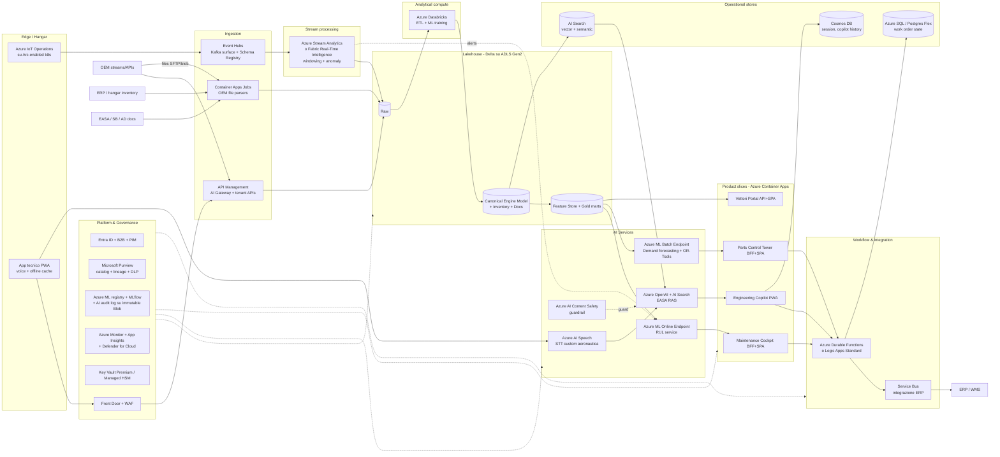

# Architettura Applicativa — Piattaforma MRO Intelligence (v0.3, Azure-first re-design)

> Bozza di alto livello. **Ignora** la lista di servizi suggerita nel brief, ma resta **cloud-first su Azure**.
> Scelte guidate dal problema, scegliendo i servizi Azure che meglio si adattano — non quelli "obbligati".
> Riferimenti: [assignment-ita.md](assignment-ita.md), [architecture-01.md](architecture-01.md) (Azure brief-constrained), [architecture-02.md](architecture-02.md) (service-agnostic).

## 1. Posizionamento

Tra le due versioni precedenti:
- **v0.1** seguiva la shopping list del brief (Fabric, IoT Hub, D365, Synapse...).
- **v0.2** era completamente aperta (Kafka, Flink, Camunda, lakehouse aperto).
- **v0.3** sceglie il **miglior servizio Azure per ciascun problema**, senza essere prigioniera della lista del brief, ma sfruttando il PaaS Azure dove ha senso (meno ops, integrazione nativa con Entra/Monitor/Purview).

## 2. Principi guida

- **Azure PaaS first, IaaS solo dove serve**: meno ops, integrazione nativa con Entra ID, Azure Monitor, Defender, Purview.
- **Open formats sul dato a riposo** (Delta su ADLS): portabilità futura, ma compute Azure-native.
- **Managed Kafka via Event Hubs (Kafka surface)** invece di Confluent self-managed: stesso protocollo, meno overhead.
- **Streaming as first-class** per il path AOG-critical.
- **AI gateway centrale** (APIM con policy AI) davanti a tutti gli LLM call: rate limit, content safety, audit, costi.
- **EU AI Act + GDPR by design**: region EU, CMK, lineage, AI audit log immutabile, human-in-the-loop.
- **Landing Zone come baseline**: Azure Landing Zones, hub-and-spoke, policy as code.

## 3. Vista logica

## 4. Scelte servizio per servizio, con motivazione

### 4.1 Edge & ingestion

| Esigenza | Servizio Azure scelto | Perché questo e non altro |
|---|---|---|
| Edge gateway in hangar | **Azure IoT Operations** su Arc-enabled Kubernetes | Successore moderno di IoT Edge, MQTT broker + dataflow nativi, gestione via Arc → consistente con resto dei workload. Sostituisce IoT Hub classico. |
| Streaming backbone | **Event Hubs (Kafka surface) + Schema Registry** | Protocollo Kafka aperto (ecosistema connettori OEM) ma fully managed Azure. Migliore del classico IoT Hub per fan-out analitico e replay. |
| API ingress/egress + AI Gateway | **Azure API Management Premium** con policy AI (token limit, semantic cache, content safety) | Un solo gateway per: OEM inbound, vettori outbound, e governance LLM call. Premium per VNet integration. |
| OEM file parsing (formati proprietari) | **Azure Container Apps Jobs** | Microservizi containerizzati, scale-to-zero, plugin per OEM. Più flessibile di Data Factory per logiche custom. **Data Factory** resta per ingestion batch standard (SFTP, JDBC). |

### 4.2 Stream processing

- **Azure Stream Analytics** o **Fabric Real-Time Intelligence (Eventstreams + KQL DB)** per windowing, anomaly detection, alert AOG.
- Decisione di default: **Fabric Real-Time Intelligence** se si sceglie Fabric come piattaforma analitica; **Stream Analytics** se si resta su Databricks/Synapse.
- Alternativa considerata e scartata: HDInsight Flink (più potente ma più ops); Spark Structured Streaming su Databricks (valido se il team è già Spark-centric).

### 4.3 Data platform — lakehouse Delta su ADLS Gen2

- **Storage**: ADLS Gen2 con hierarchical namespace, formato **Delta Lake** ovunque. Mantiene apertura del dato.
- **Compute analitico**: **Azure Databricks** come scelta primaria. Motivazione: maturità su streaming + ML + Unity Catalog (lineage e governance fine-grained), integrazione Entra ID nativa.
  - **Fabric** resta alternativa valida (più semplice, più Microsoft-stack, ma meno maturo su ML serio).
  - Decisione: **Databricks per ML/data eng pesante, Fabric per self-service analytics e Power BI**, conviventi sullo stesso Delta lake (Unity Catalog ↔ OneLake shortcuts).
- **Tre zone**: Raw → **Canonical Engine Model** (lo strato unificato richiesto dal brief) → Curated/Gold + feature store.
- **Feature store**: Databricks Feature Store (parte di Unity Catalog), condiviso tra RUL e demand forecasting.

### 4.4 AI / ML

| Capability | Servizio | Pattern |
|---|---|---|
| **RUL** | **Azure ML Online Endpoint** (managed), modelli PyTorch/scikit-survival, MLflow registry. | Inferenza near-real-time, blue/green deploy, autoscale. SHAP/Captum per explainability (EU AI Act). |
| **Spare parts demand + ottimizzazione** | **Azure ML Batch Endpoint** per forecast + container con OR-Tools per ottimizzazione multi-hangar. | Run notturni + what-if interattivo. |
| **EASA RAG** | **Azure OpenAI** (GPT-4o class) + **Azure AI Search** (vector + semantic + hybrid) + citation obbligatoria. | RAG con re-ranking; tool calling per compilare task card; output review umana. |
| **Voice** | **Azure AI Speech** custom (lessico aeronautico, robustezza al rumore). | STT → intent → routing a RAG o a comandi work order. |
| **Guardrail** | **Azure AI Content Safety** + **prompt shield** + policy APIM su semantic cache e jailbreak detection. | Pre/post filter su ogni call LLM, log immutabile. |

**MLOps**:
- **Azure ML registry + MLflow** centralizzato.
- CI/CD via **GitHub Actions** o **Azure DevOps** con gate di valutazione (accuracy, fairness, drift via Azure ML Data Drift).
- **AI audit log** su **Azure Blob Storage immutable (WORM, time-based retention)** — requisito EU AI Act.

### 4.5 Product slices (le 4 app verticali)

Tutte deployate su **Azure Container Apps** (managed Kubernetes, scale-to-zero, dapr-friendly):

- **Maintenance Cockpit**: alert AOG, predizioni RUL, suggerimento azione. SignalR per push real-time.
- **Parts Control Tower**: inventario unificato, raccomandazioni, what-if su demand forecast.
- **Engineering Copilot** (PWA): chat + voice, task card EASA, knowledge capture.
- **Vettori Portal**: API + dashboard B2B per i 6 vettori.

Stack: Next.js/React + BFF .NET o Node, autenticazione Entra ID (workforce) + Entra External ID (B2B vettori). **Power BI Embedded** per analytics ricche dentro le app (non come UX principale).

### 4.6 Workflow & integrazione

- **Azure Durable Functions** (o **Logic Apps Standard** se workflow più visivi/business): orchestrazione work order MRO. Più leggero e cloud-native rispetto a un BPM dedicato; per stati complessi EASA si usa il pattern saga su Durable.
- **Azure Service Bus** (queue + topic) per integrazione con ERP/WMS esistenti, pattern outbox per consistenza.
- **Event Grid** per eventi di dominio cross-slice (es. "work order completed" → analytics).

> Sostituisce esplicitamente **Dynamics 365 Field Service**: per work order MRO regolati EASA, un workflow code-first è più adatto e meno costoso del CRM generico.

### 4.7 Operational stores

- **Azure SQL Database** (o **Postgres Flexible Server**): stato work order, transazionale. SQL se team Microsoft-stack, Postgres se si vuole massimizzare portabilità.
- **Cosmos DB (NoSQL API)**: history conversazionale copilot, session state, dati ad alta scrittura/bassa relazione.
- **Azure AI Search**: vector + semantic index per il corpus EASA/SB/AD.

### 4.8 Platform & governance

- **Entra ID** (workforce) + **Entra External ID** (B2B con i 6 vettori) + **PIM** per accessi privilegiati.
- **Microsoft Purview**: catalog, lineage end-to-end (cross Databricks/Fabric/SQL), classificazione PII (GDPR), DLP.
- **Azure Monitor + Application Insights + Log Analytics** + **OpenTelemetry**: osservabilità unica app/dati/modelli.
- **Defender for Cloud** (CSPM + CWPP) su tutta la sub.
- **Key Vault Premium / Managed HSM**: CMK su ADLS, SQL, Cosmos, Service Bus. Rotazione automatica.
- **Azure Front Door + WAF**: ingress unico per app pubbliche (Vettori Portal, PWA hangar via internet).
- **Private Endpoints** su tutti i servizi dati e AI; VNet hub-and-spoke; Azure Firewall in hub.
- **Azure Policy + Landing Zones**: baseline compliance (region pinning EU, deny public endpoints, require CMK).

## 5. Differenze chiave vs v0.1

| Tema | v0.1 (brief-constrained) | v0.3 (Azure best-fit) |
|---|---|---|
| Ingestion stream | IoT Hub + Stream Analytics | **Event Hubs (Kafka) + IoT Operations on Arc** — più aperto, edge moderno |
| Data platform | Fabric end-to-end | **Databricks + Fabric** conviventi su Delta lake; ML serio su Databricks |
| Stream processing | Stream Analytics | **Fabric Real-Time Intelligence** o Stream Analytics, scelta esplicita |
| Workflow | Dynamics 365 Field Service | **Durable Functions + Service Bus**, ERP integration via outbox |
| App UX | Power BI + D365 dominanti | **4 product slice su Container Apps**, Power BI Embedded come componente |
| AI Gateway | Implicito | **APIM con policy AI** centrale — governance LLM, cost control |
| Edge | Implicito | **IoT Operations su Arc** esplicito |
| Vector DB | AI Search (ok) | AI Search confermato — è la scelta giusta in Azure |
| AI audit | Generico | **Blob immutable WORM** dedicato, requisito EU AI Act esplicito |
| Guardrail AI | Non trattato | **Content Safety + APIM AI policies** in pipeline obbligatoria |

## 6. Trade-off espliciti

- **Databricks + Fabric conviventi**: due piattaforme analitiche da governare. Compensato da Delta + Unity Catalog come contratto comune. Se il cliente vuole semplicità, **Fabric only** è accettabile a costo di un ML meno potente.
- **Durable Functions vs Dynamics 365**: meno "out of the box" su processi field service standard, ma molto più fedele al dominio MRO. Se il cliente ha già D365 in casa, valutare riuso.
- **Container Apps vs AKS**: Container Apps copre il 90% dei casi con meno ops. Se servono CRD custom, GPU sharing fine, o multi-tenant pesante, **AKS** diventa giustificato per i workload AI serving.
- **Azure OpenAI vs modello self-hosted**: Azure OpenAI è la scelta default (managed, region EU, compliance). Self-hosted (es. Llama su AKS con vLLM) solo se i vettori richiedono sovranità dati estrema o per ridurre costi a scala molto alta.
- **IoT Operations** è relativamente nuovo: se il team non ha esperienza, fallback a IoT Edge classico è accettabile.

## 7. Mapping requisiti → componenti

| Requisito | Componenti |
|---|---|
| AOG 11h → < 3h | IoT Operations → Event Hubs → Stream Analytics/RTI → Azure ML Online (RUL) → Maintenance Cockpit → Durable Functions |
| Visibilità ricambi (+34%) | Container Apps Jobs (ingestion) → Delta lake → Azure ML Batch + OR-Tools → Parts Control Tower |
| EASA docs −55% | ADF/Container Apps Jobs → AI Search (vector) → Azure OpenAI RAG → Engineering Copilot → review umana |
| First-time-fix 71% → 89% | RUL + RAG + Speech + work order context unificato in Cockpit/Copilot |
| Knowledge retention | Copilot come knowledge capture: voce + Q&A senior → Cosmos history → ingest in corpus AI Search |
| GDPR / EU AI Act | Region EU + Purview lineage + AI audit Blob WORM + Content Safety + PIM + CMK |

## 8. Topologia di deployment

- **Region primaria**: `francecentral` (HQ + sovranità Francia).
- **Region secondaria / DR**: `westeurope` (Paesi Bassi) — pairing nativo, latenza accettabile.
- **Landing Zone**: Azure Landing Zones, management group per ambiente (dev/test/prod) e per dominio (data, ai, integration, apps).
- **Networking**: hub-and-spoke, Azure Firewall + Bastion in hub; spoke per Data, AI, Integration, Apps, Shared services. Private Endpoints ovunque.
- **CI/CD**: GitHub Actions o Azure DevOps, IaC con **Bicep** (o Terraform AzureRM), GitOps per Container Apps via **Azure Deployment Environments** o ArgoCD su AKS dove presente.

## 9. Punti aperti

1. **Fabric vs Databricks**: convivenza (proposta default) o consolidamento su uno solo? Decisione su skill team + investimenti pregressi.
2. **IoT Operations vs IoT Edge classico**: IoT Operations è la direzione strategica ma più recente. Validare maturità per il caso d'uso.
3. **APIM Premium vs Standard v2**: Premium per VNet + multi-region, costoso. Valutare in base ai SLA vettori.
4. **Modello LLM**: Azure OpenAI GPT-4o vs modello fine-tuned vs self-hosted. Da legare a classificazione EU AI Act.
5. **Multi-tenancy 6 vettori**: workspace Databricks/Fabric per tenant, o tenant-aware con RLS? Tradeoff costo/isolamento.
6. **Volume telemetria reale**: dimensiona Event Hubs throughput units, Stream Analytics SU, costo ADLS.
7. **DR strategy**: active/passive vs active/active per il path AOG-critical?

## 10. Prossimi passi

1. Workshop per scegliere tra le tre versioni (v0.1 brief-constrained, v0.2 service-agnostic, **v0.3 Azure best-fit** — proposta come baseline).
2. Spike sul **Canonical Engine Model** con 2 OEM reali — rischio #1.
3. Definire il contratto del RUL online endpoint + AI audit log come componenti foundational.
4. PoC AI Gateway su APIM con policy AI sul caso EASA Copilot — valida governance LLM.
5. Stima costi: Event Hubs throughput, Databricks DBU, Azure OpenAI PTU, APIM Premium, Container Apps.
6. Produrre `architecture-04.md` con dettaglio sul dominio MVP (proposta: RUL end-to-end).
