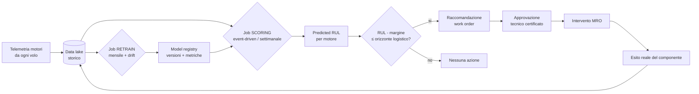

# Dal modello RUL alla produzione (MRO predittiva)

Questo documento descrive come portare il modello CNN-LSTM di stima del RUL (Remaining
Useful Life) addestrato su NASA C-MAPSS FD004 dal contesto di assignment/PoC a una
pipeline operativa di manutenzione predittiva su Azure.

Il modello attuale è una baseline: su FD004 ottiene circa `RMSE ~34` e `MAE ~26` cicli
sul test set. È adeguato per dimostrare il flusso, **non** per decisioni di sicurezza
reali senza ulteriore lavoro (vedi sezione Limiti e contesto regolatorio).

---

## 1. Idea di base

Il ciclo operativo si fonda su due job periodici e una regola decisionale:

1. **Retrain periodico** del modello su dati aggiornati.
2. **Scoring periodico** che calcola il RUL previsto per ogni motore della flotta.
3. **Regola decisionale**: i motori vicini alla soglia critica vengono pianificati per
   manutenzione preventiva, così da evitare il guasto in servizio.

Lo scheletro è corretto, ma va raffinato su quattro punti per reggere in produzione:
trigger, soglia decisionale, human-in-the-loop e loop di feedback.

---

## 2. Flusso end-to-end

Il punto chiave è l'ultimo arco: l'esito reale dell'intervento rientra nello storico e
alimenta il retraining (loop di feedback).

---

## 3. Retrain: periodico ma condizionato

Riallenare "a prescindere" ogni mese è uno spreco e un rischio (un retrain può
*peggiorare* il modello). Il job di retrain deve:

1. Riallenare su dati aggiornati.
2. Valutare sul test set di riferimento.
3. **Promuovere a produzione solo se le metriche sono almeno pari** al modello attuale
   (pattern champion/challenger).
4. Altrimenti mantenere il modello in produzione e generare un alert.

Oltre alla cadenza calendariale, va aggiunto un **trigger su drift**: se cambia la
distribuzione dei dati di input (nuovi motori, nuove rotte, stagionalità), si riallena
anche fuori dal calendario.

---

## 4. Scoring: meglio event-driven

Il RUL ha senso solo dopo nuovi voli. Se un aereo vola ogni giorno il dato cambia ogni
giorno; se è fermo, ricalcolare è inutile.

- **Driver primario**: trigger all'arrivo della telemetria di nuovi voli di una flotta.
- **Fallback**: esecuzione settimanale a calendario.

Lo scoring è intrinsecamente **batch** (si decide con ore/giorni di anticipo, non
millisecondi): un Azure ML **Batch Endpoint** è più semplice ed economico di un online
endpoint. Niente over-engineering con inferenza real-time.

---

## 5. Regola decisionale: non "RUL = X"

Il modello ha un errore (MAE ~26 cicli): affidarsi al valore puntuale è rischioso.
La soglia decisionale deve incorporare:

- **Margine d'incertezza**: copre l'errore del modello.
- **Criticità del componente**: più è critico, più il margine è conservativo.
- **Orizzonte logistico**: un motore non si ripara domani (servono hangar, ricambi,
  finestra operativa). Spesso questo orizzonte conta più del numero puntuale.

Regola pratica:

> se `RUL_predetto - margine_sicurezza <= orizzonte_di_pianificazione` allora apri una
> raccomandazione di work order.

Il costo dell'errore è **asimmetrico**: sottostimare la durata costa vita utile sprecata
(sicuro); sovrastimarla rischia il guasto in volo (inaccettabile). Il margine va tarato
su questa asimmetria.

---

## 6. Human-in-the-loop e loop di feedback

- Un modello ML **non** mette a terra un motore da solo: produce una **raccomandazione**
  che un tecnico/ingegnere certificato approva. La decisione resta umana.
- Ogni intervento rivela lo **stato reale** del componente (era davvero a fine vita?
  quanto mancava?). Questo dato è prezioso: torna nello storico, misura se il modello
  sovra/sotto-stima e migliora il retrain successivo. Senza feedback il modello non
  migliora mai.

---

## 7. Architettura Azure di riferimento

Vedi il diagramma in [mro-production-architecture.drawio](mro-production-architecture.drawio).

| Componente | Servizio Azure | Ruolo |
|---|---|---|
| Ingestione telemetria | Event Hub / IoT Hub | Raccolta dati di volo |
| Storico / feature | ADLS Gen2 (bronze/silver/gold) | Dati puliti e normalizzati |
| Retrain | Azure ML Pipeline schedulata | Riallena, valuta, promuove se migliora |
| Model registry | Funzione integrata del workspace Azure ML | Versioni, metriche, stage staging/prod |
| Immagini environment | Azure Container Registry (del workspace) | Container di training/inference |
| Scoring | Azure ML Batch Endpoint | Predizione RUL su tutta la flotta |
| Orchestrazione | Azure ML schedule + trigger event-driven | Lancia retrain e scoring |
| Output decisionale | Database (SQL / Cosmos DB) + logica di soglia | RUL + flag manutenzione |
| Integrazione MRO | Sistema EAM/CMMS | Apertura work order |
| Monitoraggio | Application Insights + AML data drift monitor | Allarmi su drift e degrado modello |

Note sui nomi:

- Il **model registry** non è un servizio separato: è una funzione integrata del
  workspace Azure ML (tipo `Microsoft.MachineLearningServices/workspaces/models`).
- **Azure ML Registry** (servizio cross-workspace) condivide asset tra più workspace:
  non serve con un solo workspace.
- **Azure Container Registry (ACR)** conserva le immagini Docker degli environment, non
  i modelli.

---

## 8. Limiti e contesto regolatorio

Questo sistema tocca la **sicurezza del volo**. Nel mondo reale:

- Vige un quadro regolatorio: **EASA Part-145** per la manutenzione; se si usa AI per
  decisioni su sistemi critici si entra anche nel perimetro dell'**EU AI Act**
  (potenziale alto rischio). Vedi `docs/regulatory-context/`.
- Servono **audit trail** completi: quale versione di modello, quali dati, quale
  predizione, chi ha approvato. Tracciabilità end-to-end.
- Un MAE di ~26 cicli è troppo alto per decisioni di sicurezza dirette. Per la
  produzione servirebbero sia un modello più accurato (es. normalizzazione per regime
  operativo su FD004) sia un approccio **probabilistico** (intervalli di confidenza,
  non solo il valore puntuale).

---

## 9. In sintesi

- Retrain periodico → **condizionato** (promuovi solo se migliora) + trigger su drift.
- Scoring → **event-driven** (all'arrivo di nuovi voli), settimanale come fallback.
- Soglia → incorpora **margine d'incertezza + orizzonte logistico**; l'azione è una
  **raccomandazione approvata da un umano**, non automatica.
- Aggiungere il **loop di feedback** dall'esito reale delle manutenzioni.
- Inquadrare tutto nel **contesto regolatorio** (human-in-the-loop, audit, EASA/AI Act).
