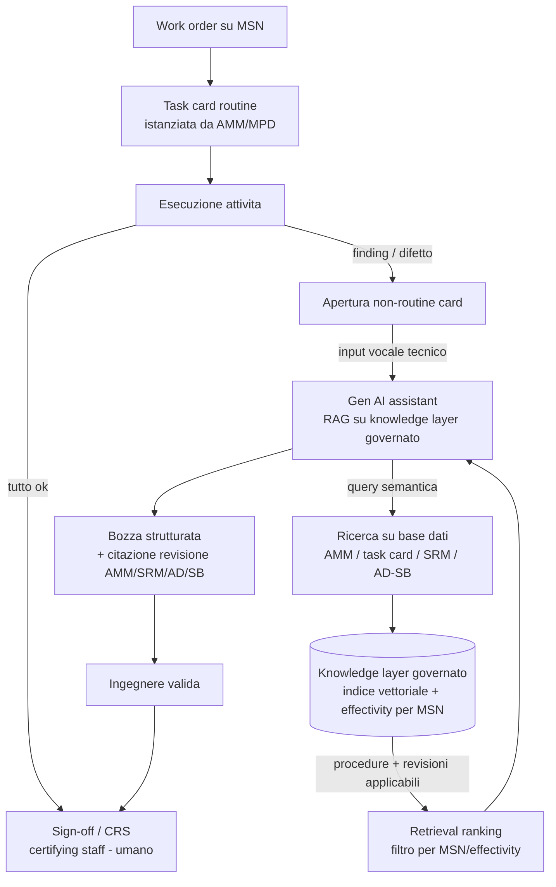

Una task card EASA è, in ambito manutenzione aeronautica, il documento operativo che descrive in modo standardizzato un’attività di manutenzione da eseguire su un aeromobile o su un componente, secondo i requisiti regolatori europei (EASA Part‑145 / Part‑M).

È la “scheda di lavoro” ufficiale che il tecnico usa per sapere cosa fare, come farlo, con quali materiali, con quali limiti e con quali criteri di accettazione.

na task card è una istruzione di lavoro manutentiva che:

* deriva dal programma di manutenzione approvato (AMP) o dal Maintenance Planning Document del costruttore
* è utilizzata da organizzazioni Part‑145
* viene compilata, firmata e restituita al reparto di programmazione come prova dell’attività eseguita

Ogni task card include tipicamente:

* Identificazione del velivolo/comparto
* Descrizione dell’attività (ispezione, sostituzione, test, riparazione)
* Riferimenti normativi e OEM (AMM, SRM, MPD, AD, SB)
* Materiali e attrezzature richieste
* Manpower e tempi stimati
* Criteri di accettazione
* Firma del tecnico e CRS (Certificate of Release to Service, quando applicabile)

esistono 2 tipologie di task card routine e non-routine

### Task card routine (schedulata)
Derivano dal maintenance program (MPD/MRB → AMM). Sono pre-ingegnerizzate una volta e poi istanziate a ogni evento di manutenzione:

quì AI aiuta la compilazione allegando revisioni giuste etc.

### task card non routine (uncheduled-findings)
Questo è il cuore dei tuoi numeri (11h AOG, 4500 ore/uomo, first-time-fix 71%→89%). Quando durante un'attività emerge un finding (difetto non previsto: crepa, corrosione, vibrazione anomala):

* si apre una non-routine card / defect report;
* l'ingegnere deve trovare la procedura applicabile (AMM/SRM/CMM + eventuali AD/SB), valutarla, e redigere la documentazione del rework.

È qui che l'assistant Gen AI dà valore: input vocale del tecnico in hangar → recupero procedura applicabile (RAG sul knowledge layer governato) → bozza strutturata della non-routine card con citazioni di revisione → l'ingegnere valida e firma.

ecco una task card: https://www.linkedin.com/posts/taranjitsingh01_aircraftmaintenance-planningengineer-aircraftengineer-activity-7335626041266225152-bLVi/ 

### flusso di lavoro

È qui che l'assistant Gen AI dà valore: input vocale del tecnico in hangar → recupero procedura applicabile (RAG sul knowledge layer governato) → bozza strutturata della non-routine card con citazioni di revisione → l'ingegnere valida e firma.

### Acronimi EASA / MRO

| Acronimo | Sigla estesa | Significato |
|----------|--------------|-------------|
| MSN | Manufacturer Serial Number | Numero di serie univoco assegnato dal costruttore al singolo aeromobile (o componente). Identifica fisicamente quell'esemplare, indipendentemente dalla marca di immatricolazione. È la chiave a cui legare effectivity, modifiche, AD/SB e storico manutentivo. |
| AMM | Aircraft Maintenance Manual | Manuale di manutenzione dell'aeromobile prodotto dall'OEM. Contiene le procedure ufficiali di manutenzione (ispezioni, rimozioni/installazioni, test). È la fonte autorevole da cui derivano le task card. Versionato per revisioni. |
| MPD | Maintenance Planning Document | Documento OEM che definisce i task di manutenzione programmata e i relativi intervalli (cicli/ore/calendario). È la base per costruire il maintenance program da cui si istanziano le task card routine. |
| CRS | Certificate of Release to Service | Certificato di riammissione in servizio. Attestazione, firmata dal certifying staff autorizzato (Part-145), che la manutenzione è stata eseguita correttamente e l'aeromobile/componente è idoneo al rientro in servizio. È l'atto finale e responsabile, sempre umano. |

# impatti sui numeri del caso studio

| Metrica | Prima | Dopo | Ruolo dell'AI |
|---|---|---|---|
| Effort documentazione EASA | 4.500 h/uomo/anno | -55% | Drafting automatico + retrieval della procedura/revisione |
| First-time-fix | 71% | 89% | Procedura corretta recuperata subito, meno errori |
| Rischio perdita conoscenza | 31% senior in uscita | mitigato | La "conoscenza di dove cercare" è codificata nel knowledge layer governato |